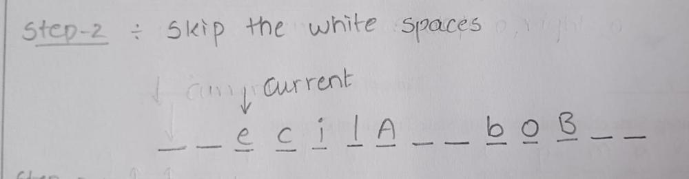
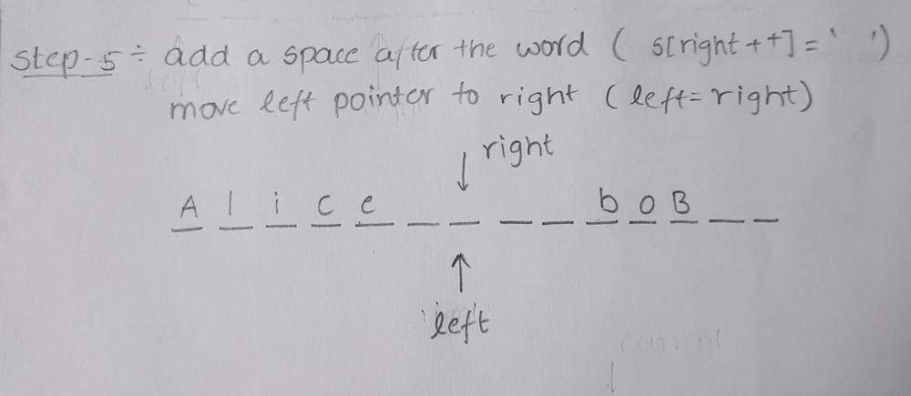

# Intuition

* Reverse the entire string
Reverse Individual words while handling the extra spaces
Remofing the extra spaces and returning

# Approach

* initialise `left=0,right=0,current=0;`

* Reverse the Entire String `reverse(s.begin(),s.end());`

* Skip Leading Spaces `while(i<n && s[i]==' ')i++;`

* Copy Characters of a Word to the correct position
`while(i<n && s[i]!=' '){ s[right++]=s[i++]; }`

* Reverse Individual Words
`reverse(s.begin()+left,s.begin()+right);`

* Add Space Between Words
`s[right++]=' '; left=right;`

* repeat the steps for all the words
  

Finally, it resizes the string to remove any extra space.
` s.resize(right-1);`

