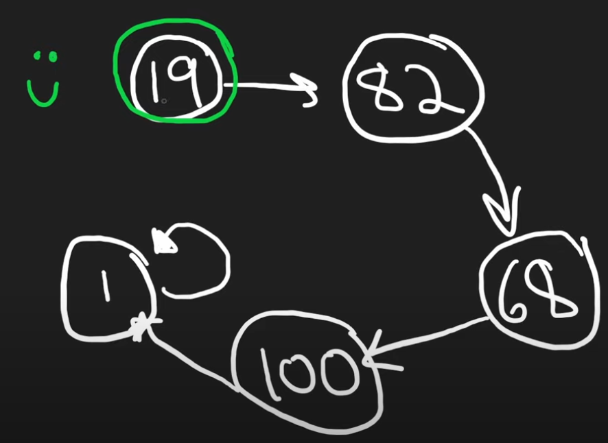
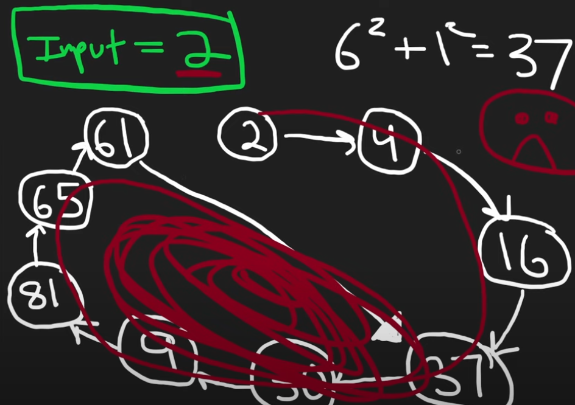

# 202. Happy Number
* Cycle Detection
* Hash-set (Finding duplicated numbers)
* Floyd's Cycle-Finding Algorithm
  * 142. Linked List Cycle II
  * 287. Find the Duplicate Number
  * 457. Circular Array Loop 
 
## Observation

* Whether the number is happy number or not, there will be a cycle
  

