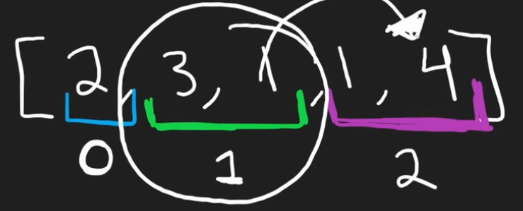

# 45. Jump Game II
* Greedy Method
* Each interval represents the reachable positions from step-to-step
  * Blue: Starting from 2 (blue), the reachable nums are 3 and 1
  * Green: For 3 and 1, the reachable nums are 1 and 4 (purple)
* Between each interval, it takes one step to walk to

