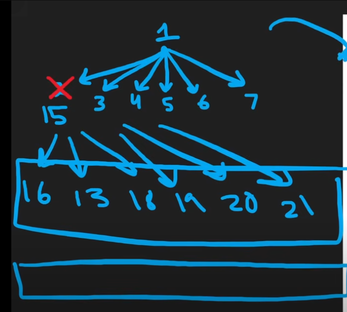

# Why BFS is preferred for finding shortest path to the target?

1. **Layered Exploration**: **BFS explores all neighbors at the current depth level before moving deeper. This guarantees that when a node is visited for the first time**, it has been reached via the shortest path in terms of the number of edges. This property is crucial for finding the shortest path efficiently in unweighted graphs.
2. **DFS's Depth-First Nature**: DFS dives deep into a path before backtracking, which can lead it to explore longer paths unnecessarily. **There’s no inherent mechanism in DFS to prioritize shorter paths—it may only find the shortest path after exhaustively exploring multiple possibilities**.
3. **Queue vs. Stack**: BFS uses a queue to systematically handle nodes in the order they’re encountered, maintaining fairness across all potential paths. DFS, on the other hand, relies on a stack (or recursion), which is better suited for exploring all paths but not for prioritizing the shortest one.