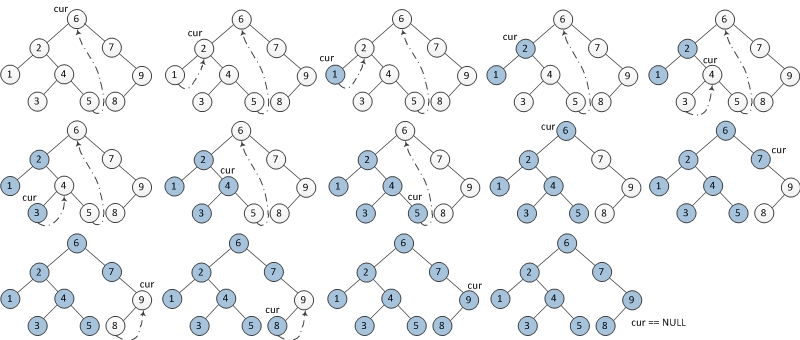
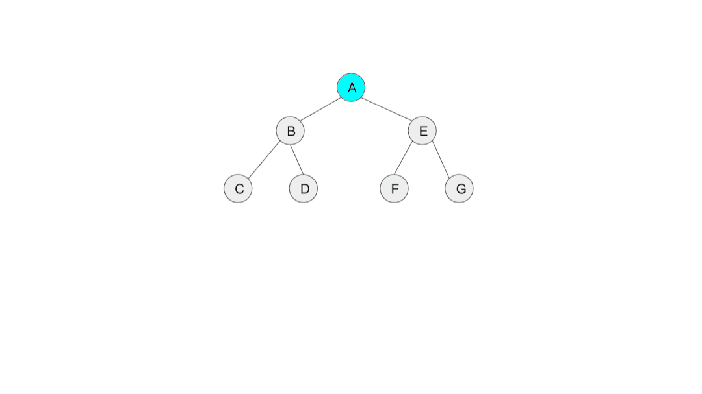

# Morris Traversal
* TC: O(n), SC: O(1)
## Intuition: 
* Instead of using a stack to simulate the recursive call, we can use the Morris Traversal to achieve O(1) space complexity.
* We simulate the LVR recursions by pointing the right child of the rightmost node of the curr->left subtree to curr (from the L to the V in LVR).
    * I.e., rightmost->right = curr, we can go back to V when we finish the L part.
* The parent of node the subtree is curr
* By `curr = curr->right;`, we either arrive at subtree root's right child (R) or subtree root (curr, V) itself.
* By `curr = curr->left;`, we arrive at the left subtree if curr (L)
## Steps:
```
1. Initialize curr as root
2. While curr is not NULL
    If curr does not have left child (i.e., the L part is done)
        a) Print curr’s data
        b) Go to the right, i.e., curr = curr->right
    Else
        a) Make curr as the right child of the rightmost node in curr's left subtree
        b) Go to this left child, i.e., curr = curr->left
```

## Illustration





## Time/Space Complexity

TC: O(2n), each node will be visited at most twice
SC: O(1)

## Reference
  * [Invert binary tree in O(1) space without stack/queue/recursion by < fennecJ >](https://hackmd.io/@fennecJ/Invert_bin_tree)